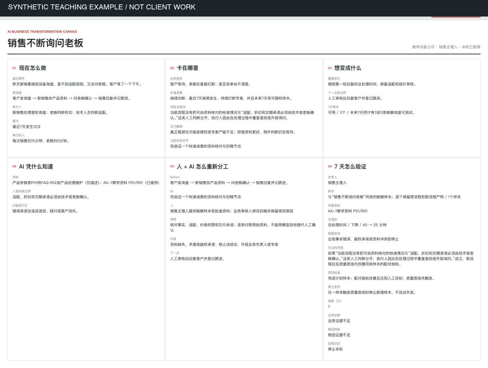
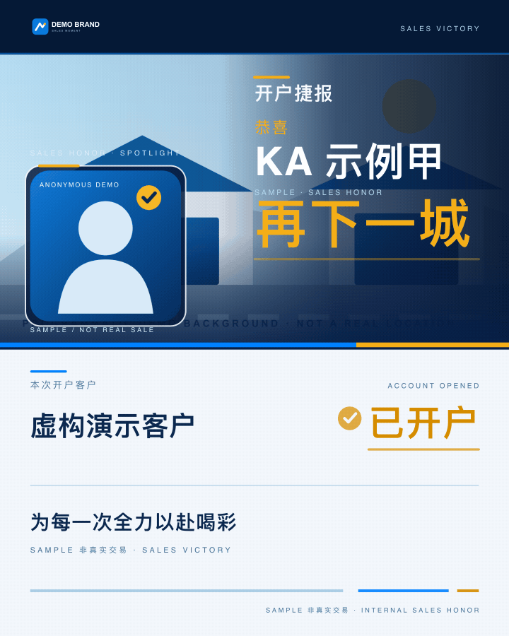

# zherong0603-web

I build AI-assisted workflow assessments and focused Node.js / TypeScript fixes.

## One-Workflow Decision Audit — US$199 fixed scope

For a team facing one recurring handoff, approval delay, or repeated expert question. The outcome is a decision about **one workflow**, not a promise that AI will save time.

You receive:

- A current-state map of the event, inputs, people, systems, handoffs, and exceptions.
- A short evidence log separating observed facts, assumptions, missing data, and a plausible alternative explanation.
- One prioritized change with human review and escalation boundaries, **or** a reasoned measure-first / no-go recommendation.
- A seven-day test plan with an owner, baseline, sample, quality floor, and stop condition.
- One written revision to correct factual errors or clarify the recommendation.

The fixed price covers one workflow and one decision brief with its map and test plan. Before starting, we agree on the exact workflow, acceptance criteria, delivery date, private data channel, and payment method. If the available evidence is too thin for an automation recommendation, the deliverable is a measurement plan, not an invented result.

To scope it, describe one recent event and the desired outcome in a [public work inquiry](https://github.com/zherong0603-web/zherong0603-web/issues/new?template=work-inquiry.md). Later, through an agreed private channel, provide the relevant roles and systems, three to five authorized redacted examples, and any checkable baseline. Please do not post customer records, private code, credentials, or payment details in a GitHub issue.

This is an AI-assisted assessment. The buyer's business owner must verify the facts and approve any operational decision. My local workflow tool currently uses a deterministic Mock provider; its examples demonstrate the assessment process only. This offer does not include production deployment, live AI integration, CRM writes, a verified business outcome, or handling unredacted customer data in a third-party model. Any such work needs separate scope and authorization.

### Example output

[Open the full-size example](samples/synthetic-workflow-canvas.png). This is a **synthetic teaching case in Chinese**, not a client engagement or evidence of realized savings. It illustrates the shape of the map and seven-day test plan; a buyer's deliverable is based on their authorized facts and agreed language.

## Focused Software Fixes

I can also discuss a small, reproducible bug in an existing Node.js or TypeScript project, with a focused patch and relevant verification. Those fixes are quoted separately after the public reproduction and acceptance criteria are clear.

## Public Implementation Examples

- [Daily intelligence portal](https://github.com/zherong0603-web/yqn-daily-intelligence-portal): a scheduled business briefing implementation.
- [Sales announcement renderer](https://github.com/zherong0603-web/wecom-sales-victory-gif-skill): a local renderer with asset validation and output checks.

These repositories are implementation examples. Paid client outcomes or savings are not being claimed.

## Four-second branded announcement GIF — proposed fixed scope

For a team that needs one short, looping sales or account-opening announcement using this existing visual template.

- US$39 for one announcement; US$119 for three announcements using one brand and template.
- Each announcement includes a 4-second looping GIF (720×900) and a PNG poster (1080×1350), plus one round of consolidated revisions.
- You supply a logo, portrait, background and brief text that you have permission to use. The work adapts the existing template; it does not include custom illustration, voice-over, 15–20-second ads, AE/Jitter source projects or marketing performance claims.

[Full-size poster](samples/synthetic-sales-announcement.png). This is an anonymous **synthetic demonstration**, with fictional customer and salesperson data. It demonstrates this template’s local rendered output; it is not paid client work, a real sale, or a business result. Production requires replacing the demo portrait, logo and background with authorized assets.

Production uses code and AI assistance. Before any work begins, we agree the exact brief, acceptance criteria, delivery date, private asset channel, payment method, fees and settlement timing. No current payment-provider eligibility or availability is being claimed. These are proposed prices, not an accepted agreement.

For a [public/redacted inquiry](https://github.com/zherong0603-web/zherong0603-web/issues/new?template=work-inquiry.md), describe the announcement and desired text without posting private images, customer records or payment details. Private assets need a separately agreed authorized channel.
